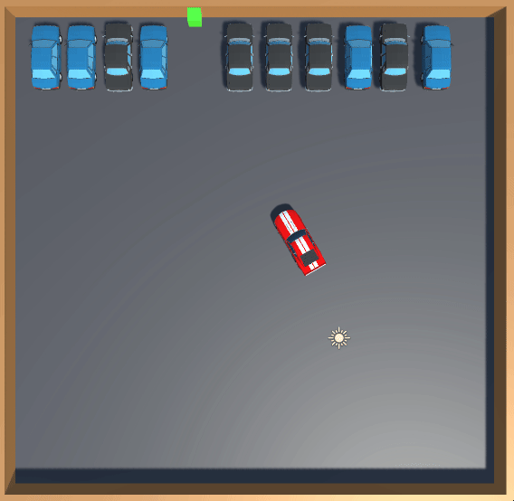

# Portfolio

## C++ Projects
- I started C++ programming in my final year of university and hve gathered experience from using it in a variety of courseworks and GameJams.

### C++ Graphics Project

- This project was made with OpenGL used to allow it to render.
- It features real-time shadows using a shadow buffer, a shader effect which uses distance to fade into a white fog to help provide scene depth. Objects in the scene are also stored in a scene graph for more efficient rendering.
- To try and imitate realistic water physics, a sin wave is used to move the water plane and boats in a bobbing motion. This imitation is effective when looking at a small section, but is a lot less effective when you can see a wider perspective of the scene.

- A problem I had during this project was shadow acne. In order for shadows to cover the full scene from the light, I had moved it further away into the void off the edge of heightmap. Unfortunately I had forgotten to change the near plane of the projection matrix of shadow scene drawer so had an issue with depth buffer causing acne.
- Upon realising that I hadn't changed the near plane distance, I increased it and solved the problem instantly.
- If I was to revisit this project, I would try and fix the post processing as had a bug where it would render one colour across whole screen as well as adjust the water to not be as reflective
- [Github Repository](https://github.com/mlhumphriss/CSC8502-OpenGLGraphicDemo)

### C++ Physics and AI Project

- This project was made using CMake and explored the creation of collision detection and resolution methods as well as creating state machine AI for a game.
- There is a state machine enemy in the maze which moves towards the player using pathfinding on a navmesh when they are in the maze, but run directly towards a player when in line of sight. This uses raycasts towards the player, and if it hits the player before a wall it'll change to chase mode.
- One slight issue with the game in general is that the physics calculations with all the objects in is taking too long and causing time outs. This results in causing the floating staircase to vibrate due to the physics calculations not being accurate enough for movement to dampen.
- If I was to come back to this I would probably add a physics object management system so that if an object is on a floor with no forces applied to it other than gravity, the system collision detection would assume the previous collision resolution are consistent until it moves or has an external force applied,
- This should then reduce the wasted processing time and hopefully allow the game to run more efficiently.
- [Github Repository](https://github.com/mlhumphriss/CSC8503-NetworkCodebase)
#### OBB to OBB collisions using Separating Axis Theorem

- One feature of the physics engine is an implementation of Separating Axis Theorem to work out collisions between two OBB objects. This is done by projecting both onto a series of axis to check if they overlap, then using the axis which does with the least penetration to get a collision point for collision resolution.
- This method wasn't a perfect solution as after a collision, the cubes take a while to settle with them rocking on the corners
- Another issue during development was that if the objects were significantly different sizes (e.g. floor and a box) it would fling them apart
- Upon further testing I realised this occurred only when the floor was the first object in collision pair, so added a check that would swap any object with tag floor to second object before the function call
- Though fixing the issue inside the function would have been more ideal as would make the physics more consistent, I was under time constraint so settled on this method to fix it
- [Function Code can be seen here](https://gist.github.com/mlhumphriss/8d80fcba81a2cb78762e527afbab33c9)

### Unreal Group GameJam - Explosive Unboxing

- This game was built on the theme of "Shot In The Dark" in roughly 10 days of part-time work, with our teams take on it being that it would be a game of random and educated guesses to not select a case with a bomb in it, with safe cases providing clues.
- The area I worked on was the player character and their inputs as well as making it possible to select certain objects in the game using the mouse, and have the system know an object has been selected.
- This was done with a mixture of c++ for the class, camera turn controls and event triggers, then a blueprint and actor components for the selection system.

- Note: Opening image in new tab allows you to see this blueprint for mouse click selection of actors easier

- [Github Repository of Game](https://github.com/AlfieOnGit/ExplosiveUnboxing)

### C++ Conway's Game of Life

- As an introduction to C++ I was tasked with creating Conway's Game of Life with features allowing me to search seeds of an inputted size for certain patterns.
- Though it could find 4 of the 6 required patterns, it was made in 4 days while I was recovering from an illness so was inefficient and had several functions that could be easily improved
- If I was making this again with the knowledge and experience I now have, I would change a chunk of it such as the cellState function which used too many comparisons to work out the alive neighbor cells.
- [Github Repository of Codebase](https://github.com/mlhumphriss/ConwayGameOfLifeAssignment1/blob/master/main.cpp)

## Unity Projects
- I have experience with using Unity as it is the engine I started working with as an undergrad.
 
### Dissertation on creating an Adaptable and Efficient Autonomous Parking System

- My dissertation used Unity in order to model an autonomous parking system
- I added the sensors and autonomous parking system to an existing model and car controller
- It used raycasts of set lengths as sensors, then a basic state machine which would drive towards the target and use the sensors and the weighted values to determine steering corrections or to stop to prevent collision.
- One fault of my system was that I didn't give it an option to reverse, which meant that if it had a wrong angle of approach, it couldn't readjust to make it into the space.
- If I was to rework it I would add the additional functionality of a reverse gear to allow the model to be able to achieve a higher success rate of parking at tighter angles of approach.
- [Copy of AutonomousController file](https://gist.github.com/mlhumphriss/a240cb7b1e46bf7ac625264cd97a413f)

### Stage 3 Games Coursework

- The focus of this coursework was creating a playable demo of a game with an emphasis on physics and enemy AI.
- To meet this brief I decided to create a 3D platformer with the aim of it to reach the highest height possible, wih score being based on height. This was made in three days.
- There are a dozen Navmesh navigation based AI "slimes" on the floor of the map. These are designed less to be a threat at the beginning, but more to be an additional punishment mechanic if the player falls.
- If I was to go back to this project, I would add flying enemies with a set path, to add more complexity and risk of losing towards the end of the game as just becomes a jump puzzle.
